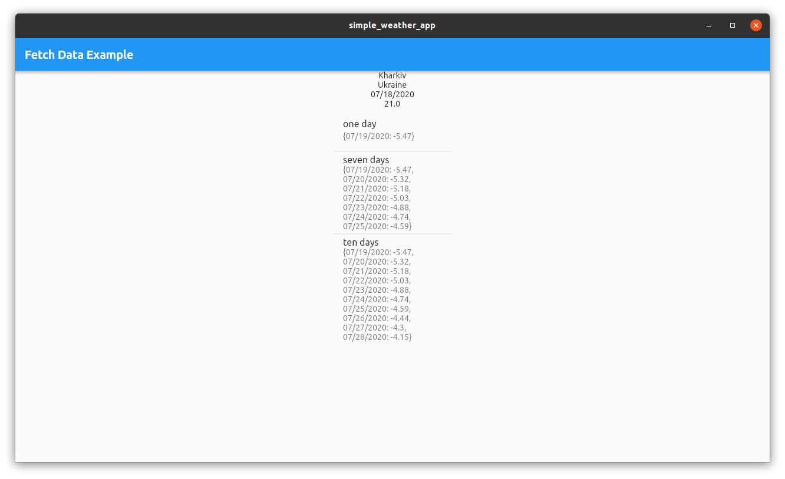

# simpleweatherapp

Show temperature at your location as well your city, country and which day is today

It's frontend part. For backend, please, go [here](https://github.com/Oysiyl/Weather_app)

App is available through Google Play Market, Snapcraft and as a web application

